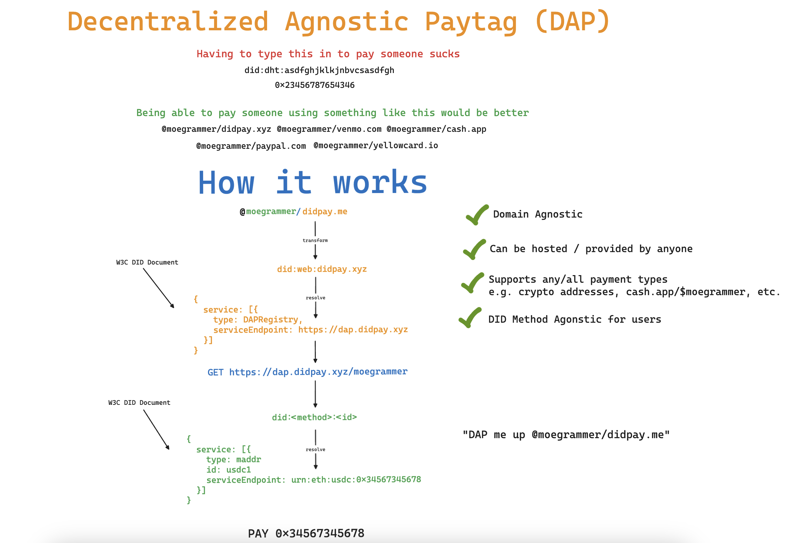

# Decentralized Agnostic Paytag (DAP) <!-- omit in toc -->

> [!WARNING]
> 🚧 WIP 👷‍♂️


# Table of Contents <!-- omit in toc -->
- [Problem Statement](#problem-statement)
- [Objective](#objective)
- [Requirements](#requirements)
- [TL;DR How it Works](#tldr-how-it-works)
- [DAP](#dap)
  - [Local Handles](#local-handles)
  - [Domain](#domain)
- [Resolution](#resolution)
  - [Example](#example)
- [Money Address](#money-address)
    - [Examples](#examples)
      - [USDC on Ethereum](#usdc-on-ethereum)
      - [BTC LNURL](#btc-lnurl)
      - [BTC Address](#btc-address)
      - [BTC Silent Payment Address (BIP-0352)](#btc-silent-payment-address-bip-0352)
      - [KES Mobile Money](#kes-mobile-money)
    - [Currency Specific Parts](#currency-specific-parts)
      - [USDC](#usdc)
        - [Network specific Address](#network-specific-address)
          - [Format](#format)
          - [Examples](#examples-1)
      - [BTC](#btc)
        - [LNURL](#lnurl)
          - [Format](#format-1)
        - [Address](#address)
          - [Format](#format-2)
        - [Silent Payment Address](#silent-payment-address)
          - [Format](#format-3)
  - [DID Resource](#did-resource)
    - [Examples](#examples-2)
      - [Example Service Entry](#example-service-entry)
      - [Example DID Document](#example-did-document)
- [DAP Registry](#dap-registry)
  - [Registry HTTP API](#registry-http-api)
    - [CORS Policy](#cors-policy)
    - [Responses](#responses)
    - [Error](#error)
    - [DAP Resolution](#dap-resolution)
      - [Request](#request)
      - [Response](#response)
        - [Errors](#errors)
          - [Not Found](#not-found)
    - [DAP Registration](#dap-registration)
      - [Request](#request-1)
      - [Response](#response-1)
      - [Signature](#signature)
      - [Digest](#digest)
    - [Metadata](#metadata)
      - [Request](#request-2)
      - [Response](#response-2)
        - [`RegistrationMetadata`](#registrationmetadata)
- [Privacy Considerations](#privacy-considerations)
- [Adoption Considerations](#adoption-considerations)
  - [Pre-existing apps](#pre-existing-apps)
    - [Example](#example-1)
  - [New Apps](#new-apps)
- [FAQ](#faq)
  - [How is this different from UMA (Universal Money Address)?](#how-is-this-different-from-uma-universal-money-address)
  - [Where did the name DAP come from?](#where-did-the-name-dap-come-from)
  - [What makes this solution decentralized?](#what-makes-this-solution-decentralized)


# Problem Statement
Countless applications exist worldwide (e.g. CashApp, YellowPay, Bitso, Coinbase, Chipper Cash, Paypal, Venmo etc.) that allow individuals to send and receive money using a variety of payment methods and financial instruments. These apps often provide a P2P function that allows individuals using the same app to send and receive money to/from one another using memorable handles, paytags or aliases. These paytags however are only useful within the context of the app they are created in and cannot be used to send and receive money to/from individuals using other apps or services. Sending the same currency accross different apps or payment networks is a notoriously cumbersome and error-prone process that often involves copy / pasting long, confusing, and nuanced mumbo jumbo. Further, depending on the type of currency being used, the process can be even more complex. For example: 
* sending BTC on Lightning is different than sending BTC on mainnet
* sending USDC on Ethereum has different details and nuances than sending USDC on Stellar.
* sending fiat money to a mobile money wallet is different than sending it to a bank account.

What this leaves us with are many large payment networks that all exist on their own islands. Life is great on the island but getting money onto and off the island is a "yeet and hope for the best" kind of situation. Further, indviduals are left to navigate and understand the nuances of whatever currency they're hoping to use. This is a problem because it makes it difficult for individuals to use the currency of their choice in the way that they want to. Moreover, an inevitable lengthy conversation occurs between two people prior to sending any money, in order to figure out what the hell one another even has or can use to send and receive money. As a result, individuals end up with 18 wallets and a tense negotiation about which one to use everytime they need to send or receive.

# Objective

> [!IMPORTANT]
> Alice should be able to send money to Bob using a memorable handle (aka DAP) regardless of what app or currency is being used. A DAP should be simple yet distinct from other widely recognized handles: `@handle/domain` e.g. `@moegrammer/didpay.me`. 

The conversation between Alice and Bob should be as simple as:
```
Alice: Yo Bobby boy! Thanks for the coffee. What's your DAP so i can pay you back?
Bob: Anytime. DAP me up at @waterboy/cash.app
```

Alice should then be able to pop open whatever app she uses, type in bob's DAP, and send him the money. Bob should then be able to receive the money in whatever app he uses. Hypothetical examples of this are:
* CashApp -> YellowPay (or vice versa)
* Chipper Cash -> Bitso (or vice versa)
* Coinbase -> CashApp (or vice versa)
* CashApp -> Self Custodial Wallet (or vice versa)
* Paper Wallet -> Paper Wallet


More concretely, The objective of this specification is to provide a standardized means to: 
* express a _money address_
* associate any number of money addresses to a resolvable identifier (DID)
* register the identifier with a handle at any/many DAP registries (e.g. registering `did:dht:3456787654323rfvcxaw34tf` with CashApp under the handle `moegrammer` results in `@moegrammer/cash.app`)
* resolve a DAP to a DID

# Requirements
* _Any_ currency should be expressable as a _money address_
* _Any_ individual or institution **MUST** be able to run their own DAP Registry
* An individual **MUST** have the ability to custody and control their own resolvable identifier

# TL;DR How it Works



> [!NOTE]
> Link to diagram available [here](https://link.excalidraw.com/readonly/EqLd46WRYtdXwLOsCZkR)


# DAP

A Decentralized Agnostic Paytag (DAP) is a human-friendly email-like handle that can be shared between individuals for the purposes of sending and recieving money. More specifically, a DAP can be _resolved_ to retrieve information about what currencies and payment networks an individual can receive money on.

A DAP resolves to a Decentralized Identifier ([DID](https://www.w3.org/TR/did-core/)) by the registry associated to the domain portion of the DAP. The resulting DID is then resolved to retrieve all of the active [money addresses](#money-address) where the individual is able to receive payment.

> [!IMPORTANT]
> DAPs have nothing to do with the actual mechanics of sending and receiving money. They are simply a means to easily retrieve information about how to send and receive money to/from an individual.

A DAP is composed of a _local handle_ and a _domain_ and is structured as follows:

```
@local-handle/domain
```

> [!NOTE]
> We've chosen a format that is notably distinct from email addresses in order to prevent confusion between the two particularly within contexts where email addresses are already in use.

## Local Handles
A handle is unique to the _domain_ that it is registered at. The handle itself is _NOT_ globally unique. The entire DAP itself however, is globally unique. As such, restrictions on the format are left to the _domain_ that the DAP is registered at. If no pre-existing format is defined, the following is recommended:

- **UTF-8 Encoding**: All characters should be UTF-8 encoded to support internationalization.
- **Character Exclusions**: The local handle must not include [unicode control characters](https://en.wikipedia.org/wiki/Unicode_control_characters) or [punctuation characters](https://en.wikipedia.org/wiki/Template:Punctuation_marks_in_Unicode).
- **Length Restrictions**: The local handle must be between 3 to 30 characters in length.

> [!NOTE] 
> providing the flexibility for domains to define their own formats was decided upon in order to support pre-existing systems that already have their own formats. 

## Domain
The domain portion of a DAP is used to identify the registry at which the DAP was registered. The domain is used to resolve the DAP to a DID. 

# Resolution

1. split the DAP into two parts, localHandle and domain using the last / as the delimiter. The @ is _not_ considered to be part of the local handle. 
2. Construct a `did:web` DID using the domain as the method-specific identifier.
3. [Resolve](https://www.w3.org/TR/did-core/#did-resolution) the resulting DID to retrieve the [DID Document](https://www.w3.org/TR/did-core/#dfn-did-documents).
4. Find the `service` of type `DAPRegistry` in the [DID Document](https://www.w3.org/TR/did-core/#dfn-did-documents).
5. Use the `serviceEndpoint` of the resulting service to construct the following URL: `<serviceEndpoint>/daps/<local-handle>`.
6. Make a GET request to the constructed URL.
7. The response will contain the DID associated with the DAP.
8. [Resolve](https://www.w3.org/TR/did-core/#did-resolution) the DID to retrieve the [DID Document](https://www.w3.org/TR/did-core/#dfn-did-documents).
9. Find all of the `MoneyAddress` services in the [DID Document](https://www.w3.org/TR/did-core/#dfn-did-documents).

## Example
For the DAP `@moegrammer/cash.app`:
1. Split into local handle `moegrammer` and domain `cash.app`.
2. Construct a `did:web` DID: `did:web:cash.app`.
3. Resolve `did:web:cash.app` to get the DID Document.
4. Find the `DAPRegistry` service in the DID Document.
5. Use the service endpoint to construct the URL: `<serviceEndpoint>/daps/moegrammer`.
6. Make a GET request to this URL.
7. The response contains the DID associated with `moegrammer/cash.app`.
8. Resolve this DID to get the DID Document.
9.  Find all `MoneyAddress` services in the DID Document.

# Money Address

A money address is a [Uniform Resource Name (URN)](https://datatracker.ietf.org/doc/html/rfc8141) that represents a means through which an individual can be payed a specific currency. The URN is structured as follows:

```
urn:<currency_code>:<curr_specific_part>
```

### Examples

#### USDC on Ethereum

`urn:usdc:eth:0x1234567890abcdef1234567890abcdef12345678`

#### BTC LNURL

`urn:btc:lnurl:https://someurl.com`


#### BTC Address

`urn:btc:addr:1LMcKyPmwebfygoeZP8E9jAMS2BcgH3Yip`

#### BTC Silent Payment Address ([BIP-0352](https://github.com/bitcoin/bips/blob/master/bip-0352.mediawiki))

`urn:btc:spaddr:sp1qqweplq6ylpfrzuq6hfznzmv28djsraupudz0s0dclyt8erh70pgwxqkz2ydatksrdzf770umsntsmcjp4kcz7jqu03jeszh0gdmpjzmrf5u4zh0c`

#### KES Mobile Money

`urn:kes:momo:mpesa:254712345678`

### Currency Specific Parts

> [!IMPORTANT] 
> from a standards perspective, a Currency Secific Part is an arbitrary string. There are no constraints or limitations. However, in order for Money Addresses to be of any practical use, conventions will need to be established for each currency. A separate registry will be maintained for currency specific parts as these conventions emerge.

This specification proposes Currency Specific Parts for USDC and BTC.

#### USDC

##### Network specific Address

###### Format
`urn:usdc:<network>:<address>`

###### Examples
| URN                                                       | CSP                                              | Description              |
| :-------------------------------------------------------- | :----------------------------------------------- | :----------------------- |
| `urn:usdc:eth:0x1234567890abcdef1234567890abcdef12345678` | `eth:0x1234567890abcdef1234567890abcdef12345678` | USDC address on Ethereum |
| `urn:usdc:xlm:0xff35866aCb80ce4b169d1460cd48108955c1c445` | `xlm:0xff35866aCb80ce4b169d1460cd48108955c1c445` | USDC address on Stellar  |

#### BTC

##### LNURL

###### Format
`urn:btc:lnurl:<url>`

##### Address

###### Format
`urn:btc:addr:<address>`

##### Silent Payment Address

###### Format
`urn:btc:spaddr:<address>`

## DID Resource

A Money address is associated to a DID by representing it as a [Service](https://www.w3.org/TR/did-core/#services) entry on a [DID Document](https://www.w3.org/TR/did-core/#dfn-did-documents).

> [!NOTE]
> [Services](https://www.w3.org/TR/did-core/#services) are used in DID documents to express ways of communicating with the respected DID subject. A service can be any type of service the DID subject wants to advertise, including decentralized identity management services for further discovery, authentication, authorization, or interaction.

Money addresses are represented as a service of type `MoneyAddress` in the DID Document. The service is structured as follows:

| field             | value          | description                                                                |
| :---------------- | :------------- | :------------------------------------------------------------------------- |
| `type`            | `MoneyAddress` | **MUST** always be `MoneyAddress`                                          |
| `id`              | `[]string`     | an abitrary string that can be used to uniquely identify the money address |
| `serviceEndpoint` | `[]string`     | 1 or more payment address URNs                                             |

> [!NOTE]
> Any number of money addresses can be associated with a DID. They can be represented as individual service entries in the DID Document.

### Examples

#### Example Service Entry
```json
{
  "type": "MoneyAddress",
  "id": "#some-id",
  "serviceEndpoint": ["urn:<currency_code>:<curr_specific_part>"]
}
```

#### Example DID Document

> [!NOTE]
> Other fields in the DID Document have been omitted for brevity

```json
{
  "@context": "https://www.w3.org/ns/did/v1",
  "id": "did:dht:123456789abcdefghi",
  "service": [
    {
      "type": "MoneyAddress",
      "id": "#some-id",
      "serviceEndpoint": ["urn:usdc:eth:0x1234567890abcdef1234567890abcdef12345678"]
    }
  ]
}
```

# DAP Registry

A DAP Registry is a service that is responsible for maintaining a mapping of local handles to DIDs registered at the domain hosting the registry. The service provides two primary operations: 
1. Associate a local handle with a DID (a.k.a DAP Registration)
2. Resolve a DAP to a DID. 

A DAP Registry can be hosted by any individual or institution that controls a domain. In order to provide a DAP Registry a domain **MUST**:
* host a resolvable [DID Document](https://www.w3.org/TR/did-core/#dfn-did-documents) per the [`did:web` specification](https://w3c-ccg.github.io/did-method-web/). 
    * e.g. `did:web:cash.app` resolves to `https://cash.app/.well-known/did.json`
* advertise the DAP Registry as a service in the domain's DID Document e.g.

```json
{
  "id": "did:web:cash.app",
  "service": [
    {
      "type": "DAPRegistry",
      "serviceEndpoint": ["https://dap.cash.app"],
      "id": "#some-id"
    }
  ]
}
```

> [!NOTE]
> the value of `serviceEndpoint` is the base URL of the domain's DAP Registry HTTP API and can be any URL that the domain owner chooses.

## Registry HTTP API

All DAP Registries **MUST** provide an HTTP API that adheres to the following specifications:

### CORS Policy
The DAP Registry **MUST** have a [CORS policy](https://developer.mozilla.org/en-US/docs/Web/HTTP/CORS) that allows requests from any origin. This is to ensure that a registry can be accessed by any app or service that wishes to resolve a DAP or facilitate registration (if the registry allows it).

### Responses
All responses from the DAP Registry **MUST** be a JSON Object that contains the following entries:

| Field   | Data Type         | Required | Description                                                  |
| :------ | :---------------- | -------- | :----------------------------------------------------------- |
| `data`  | `any`             | N        | set to whatever an endpoint is supposed to return on success |
| `error` | [`Error`](#error) | N        | set if an error occurs                                       |

> [!IMPORTANT]
> `data` and `error` are mutually exclusive. Only one of them should be present in a response.

### Error
An `Error` object is a JSON object that contains the following entries:

| Field     | Data Type | Required | Description                                     |
| :-------- | :-------- | -------- | :---------------------------------------------- |
| `message` | `string`  | Y        | human readable message that describes the error |


The following headers **MUST** be included in every response:

| header         | value              |
| :------------- | :----------------- |
| `Content-Type` | `application/json` |


### DAP Resolution

> [!WARNING]
> TODO: Fill out

#### Request
**Method**: `GET`

---

**URL**: `<serviceEndpoint>/daps/<local-handle>`

---

#### Response

| Field   | Data Type | Required | Description                                           |
| :------ | :-------- | :------- | :---------------------------------------------------- |
| `did`   | `string`  | Y        | The DID associated to the DAP provided in the request |
| `proof` | `string`  | N        | Signed payload sent when the DID was registered       |

##### Errors

###### Not Found

**Status Code**: `404`

### DAP Registration

The DAP Registration endpoint is used to register a local handle with a DID at the domain hosting the registry.

> [!IMPORTANT]
> This endpoint is **NOT** required to be implemented by all DAP Registries. It is up to the domain owner to decide if they want to allow individuals to register their own DIDs with their handles.
>
> You can determine whether a registry permits registration by checking the metadata endpoint.

#### Request
**Method**: `POST`

---

**URL**: `<serviceEndpoint>/daps`

---

**Body**

The body of the request is a JSON object that contains the following properties:

| Field       | Data Type | Required | Description                                                                 |
| :---------- | :-------- | :------- | :-------------------------------------------------------------------------- |
| `id`        | `string`  | Y        | typeid with prefix `reg`                                                    |
| `domain`    | `string`  | Y        | The domain that the handle is being registered at                           |
| `handle`    | `string`  | Y        | desired handle                                                              |
| `did`       | `string`  | Y        | DID being registered                                                        |
| `signature` | `string`  | Y        | Compact JWS with detached content. See [here](#signatures) for more details |

#### Response

**Status**: `202: Accepted`

> [!WARNING]
> TODO: Fill out
>
> Response should include a signature over the registration request digest. The signature **MUST** be computed using a private key associated to the registry's DID.
>
> TODO: Include `303: See Other` with a `Location` header that contains a URL for further authentication. This is to allow for scenarios where the registry is a pre-existing app that provides handles to individuals via their sign up process and wants to allow individuals to associate their own DIDs with their handles.

#### Signature

The Registration Request signature is a detached content compact JWS as defined in [RFC-7515](https://datatracker.ietf.org/doc/html/rfc7515) (Detached content defined in [appendix F](https://datatracker.ietf.org/doc/html/rfc7515#appendix-F)).

> [!NOTE]
> Why detatched JWS?
> Detached signatures are employed to facilitate scenarios where the payload (i.e., the data being signed) is already available or transmitted separately. By using a detached signature, the original payload remains unaltered and can be transmitted or stored in its native format without being embedded in the signature itself. This approach avoides redundancy but also allows recipients to independently verify the integrity and authenticity of the payload using the detached signature and the signer's public key.

The signature is computed using a private key whose public key is present as a [verification method](https://www.w3.org/TR/did-core/#verification-methods) with an [assertion method](https://www.w3.org/TR/did-core/#assertion) [verification relationship](https://www.w3.org/TR/did-core/#verification-relationships) when resolving the DID being registered.

Perform the following steps to compute the signature:
1. Construct the JWS Header as defined [here in RFC7515](https://datatracker.ietf.org/doc/html/rfc7515#section-4). The header **MUST** include the following properties:
   * [`alg`](https://datatracker.ietf.org/doc/html/rfc7515#section-4.1.1)
   * [`kid`](https://datatracker.ietf.org/doc/html/rfc7515#section-4.1.4) - the fully qualified [assertion method ID](https://www.w3.org/TR/did-core/#verification-methods) 
2. Compute the registration request's [digest](#digests) and use it as the JWS Payload 
3. Compute the JWS as defined [here in RFC7515](https://datatracker.ietf.org/doc/html/rfc7515#section-5.1)
4. detach the payload as defined [here in RFC7515](https://datatracker.ietf.org/doc/html/rfc7515#appendix-F)
5. set the value of the `signature` property to the resulting compact detached JWS

#### Digest
A digest is a representation of data in a condensed form. When used in cryptographic contexts, this condensed form provides a way to verify the integrity and authenticity of data without having to compare the data in its entirety.

perform the following steps to compute the registration request's digest:
1. Initialize _payload_ to be a json object that contains all of the registration request's properties _except_ for the `signature` property
2. JSON serialize _payload_ using the JSON Canonicalization Scheme (JCS) as defined in [RFC-8785](https://datatracker.ietf.org/doc/html/rfc8785)
3. compute the sha256 hash of the serialized payload
4. base64url encode the hash **without padding** as defined in [RFC-7515](https://datatracker.ietf.org/doc/html/rfc7515#appendix-C)


> [!NOTE]
>  Why JSON Canonicalization Scheme (JCS)?
>
> * **Consistency**: JSON does not guarantee property order. Two semantically identical JSON objects can have their properties serialized in different orders. This can lead to two different serialized strings for the same data.
When performing cryptographic operations, such as creating a digital signature or a hash, even the slightest difference in input data results in a drastically different output. Therefore, a consistent, canonical form of the data is essential.
>
> * **Interoperability**: Different implementations and libraries serialize JSON differently. JCS ensures that different systems and libraries produce the same serialized output for the same input, thus facilitating interoperability.
>
> * **Avoidance of Data Ambiguity**: JSON allows for multiple valid representations of the same data (e.g., the use of whitespace, number representations). This can cause ambiguity in interpreting or processing such data, especially in cryptographic contexts where precision is paramount.
JCS defines a single, unambiguous representation for any given JSON document.
>
> * **Security**: In the world of security, particularly with cryptographic signatures, the principle of "what you see is what you sign" is critical. If there's any ambiguity in the serialized data form, it can lead to potential vulnerabilities or issues. By ensuring a canonical format, JCS mitigates potential attack vectors related to JSON's flexibility.
>
> * **Compatibility with Existing JSON Parsers**: JCS is designed to work seamlessly with existing JSON parsers. This makes it relatively straightforward to integrate into systems already using JSON without requiring significant changes to the existing infrastructure.

> [!NOTE] 
>  Why SHA256?
> * **Widely Recognized and Adopted**: SHA256, which is part of the SHA-2 (Secure Hash Algorithm 2) family, is widely recognized and adopted in various cryptographic applications and protocols. SHA256 is standardized by the National Institute of Standards and Technology (NIST) in the U.S. Being a standard means it has undergone extensive review and evaluation by experts in the field.
> * **Security**: As of today, SHA256 has no known vulnerability to collision attacks, preimage attacks, or second preimage attacks. 
>   * A collision attack is when two different inputs produce the same hash. 
>   * A preimage attack is when, given a hash, an attacker finds an input that hashes to it. 
>   * A second preimage attack is when, given an input and its hash, an attacker finds a different input that produces the same hash. 
> * **Output Size**: SHA256 provides a fixed hash output of 256 bits (32 bytes). This size strikes a balance between efficiency and security


> [!NOTE]
> Why Base64url?
>
> When sending a SHA-256 hash (or any binary data) over the wire, it's common to use an encoding that translates the binary data into a set of characters that can be safely transmitted over systems that might not handle raw binary well.
>
> Base64url-encoded data is safe for transmission over most protocols and systems since it only uses printable ASCII characters. It is widely supported across several programming languages.
>
> A raw SHA256 hash is 32 bytes. When base64 encoded it becomes a 44 byte string

### Metadata

The metadata endpoint is used to retrieve information about the DAP Registry (e.g. what operations are supported)

#### Request
**Method**: `GET`

---

**URL**: `<serviceEndpoint>/metadata`

---

#### Response

The response is a JSON object that contains the following properties:

| Field          | Data Type              | Required | Description |
| :------------- | :--------------------- | :------- | :---------- |
| `registration` | `RegistrationMetadata` | Y        |             |

##### `RegistrationMetadata`
The `RegistrationMetadata` object contains the following properties:

| Field                 | Data Type  | Required | Description                               |
| :-------------------- | :--------- | :------- | :---------------------------------------- |
| `enabled`             | `boolean`  | Y        | Indicates whether registration is enabled |
| `supportedDidMethods` | `[]string` | N        | Supported DID Methods                     |


# Privacy Considerations

> [!WARNING]
> TODO: Fill out

# Adoption Considerations

## Pre-existing apps

Pre-existing apps that provide individuals with usernames, handles, or paytags can provision a DAP for each pre-existing handle by making it resolvable as a `did:web` (e.g. `did:web:<domain>:<handle>`). 

### Example

CashApp is a pre-existing app that provides individuals with CashTags (e.g. `$moegrammer`) and decides to adopt DAPs by standing up a DAP Registry.

Per the [DAP Registry](#dap-registry) section of this specification, CashApp creates a `did:web` (specifically `did:web:cash.app`) by hosting a DID Document at `https://cash.app/.well-known/did.json` and advertises their Registry as a service in the DID Document. 

CashApp makes each CashTag resolvable as a `did:web` (e.g. `did:web:cash.app:moegrammer`) per the `did:web` specification for [resolution](https://w3c-ccg.github.io/did-method-web/#read-resolve) by responding to requests to `https://cash.app/moegrammer/did.json` with a DID Document specific to the CashTag. The resulting DID Document contains two money address service entries: one that includes a BTC address, and another that includes an LNURL. 

As a result, every CashTag can now be used as a DAP. `@moegrammer/cash.app` is resolved using CashApp's DAP Registry to `did:web:cash.app:moegrammer` which in turn resolves to the DID Document that contains the aforementioned money addresses. 

Any app that supports sending money to a DAP can now send BTC via L1 or Lightning directly to any CashTag without the sender having to ask the recipient for a lightning invoice or what their BTC address is. The only information the sender needs is the recipient's DAP (e.g. `moegrammer@cash.app`). The sender's app will take care of the rest. As is the case with receiving BTC on CashApp today, the recipient will receive a push notification when their BTC arrives.

> [!NOTE]
> This is not too far fetched as CashApp already provides unique resolvable URLs per CashTag e.g. [https://cash.app/$moegrammer](https://cash.app/$moegrammer) that can be used to retrieve a CashApp specific QR code.

Lasty, CashApp can allow individuals to BYODID (Bring Your Own DID) by enabling Registration at their DAP Registry. This would allow individuals to associate a DID they control with their CashTag.


## New Apps

> [!WARNING]
> TODO: Fill out

# FAQ

## How is this different from UMA (Universal Money Address)?

> [!WARNING]
> TODO: Fill out


## Where did the name DAP come from?

> [!WARNING]
> TODO: Fill out

## What makes this solution decentralized?

> [!WARNING]
> TODO: Fill out
