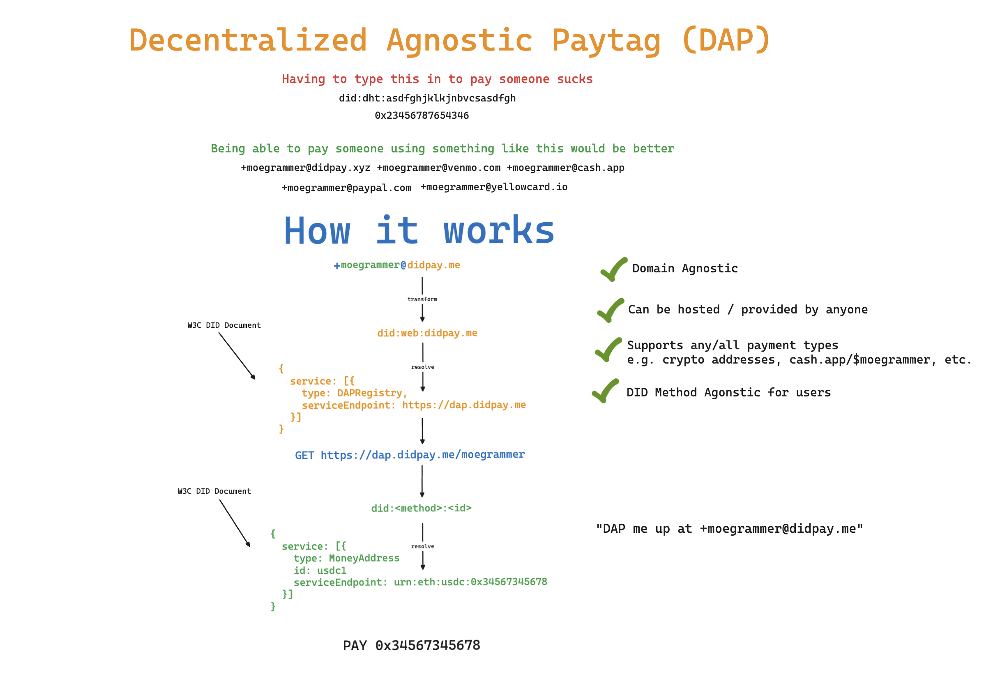

# Decentralized Agnostic Paytag (DAP) <!-- omit in toc -->

> [!WARNING]
> 🚧 WIP 👷‍♂️


# Table of Contents <!-- omit in toc -->
- [Problem Statement](#problem-statement)
- [Objective](#objective)
- [Requirements](#requirements)
- [TL;DR How it Works](#tldr-how-it-works)
- [DAP](#dap)
  - [Local Handles](#local-handles)
    - [ABNF](#abnf)
    - [Regex](#regex)
  - [Domain](#domain)
- [Resolution](#resolution)
- [Money Address](#money-address)
  - [Payment Address](#payment-address)
    - [Examples](#examples)
      - [USDC on Ethereum](#usdc-on-ethereum)
      - [BTC LNURL](#btc-lnurl)
      - [BTC Address](#btc-address)
      - [KES Mobile Money](#kes-mobile-money)
    - [Currency Specific Parts](#currency-specific-parts)
      - [USDC](#usdc)
        - [Network specific Address](#network-specific-address)
          - [Format](#format)
          - [Examples](#examples-1)
      - [BTC](#btc)
        - [LNURL](#lnurl)
          - [Format](#format-1)
        - [Address](#address)
          - [Format](#format-2)
- [DAP Registry](#dap-registry)
- [Privacy Considerations](#privacy-considerations)
- [FAQ](#faq)
  - [How is this different from UMA (Universal Money Address)?](#how-is-this-different-from-uma-universal-money-address)


# Problem Statement
Countless applications exist worldwide (e.g. CashApp, YellowPay, Bitso, Coinbase, Chipper Cash, Paypal, Venmo etc.) that allow individuals to send and receive money using a variety of payment methods and financial instruments. These apps often provide a P2P function that allows individuals using the same app to send and receive money to/from one another using memorable handles, paytags or aliases. These paytags however are only useful within the context of the app they are created in and cannot be used to send and receive money to/from individuals using other apps or services. Sending the same currency accross different apps or payment networks is a notoriously cumbersome and error-prone process that often involves copy / pasting long, confusing, and nuanced mumbo jumbo. Further, depending on the type of currency being used, the process can be even more complex. For example: 
* sending BTC on Lightning is different than sending BTC on mainnet
* sending USDC on Ethereum has different details and nuances than sending USDC on Stellar.
* sending fiat money to a mobile money wallet is different than sending it to a bank account.

What this leaves us with are many large payment networks that all exist on their own islands. Life is great on the island but getting money onto and off the island is a "yeet and hope for the best" kind of situation. Further, indviduals are left to navigate and understand the nuances of whatever currency they're hoping to use. This is a problem because it makes it difficult for individuals to use the currency of their choice in the way that they want to. Moreover, an inevitable lengthy conversation occurs between two people prior to sending any money, in order to figure out what the hell one another even has or can use to send and receive money. As a result, individuals end up with 18 wallets and a tense negotiation about which one to use everytime they need to send or receive.

# Objective

> [!IMPORTANT]
> Alice should be able to send money to Bob using a memorable handle (aka DAP) regardless of what app or currency is being used. A DAP should be as simple as an email address: `handle@domain` e.g. `moegrammer@didpay.me`. 

The conversation between Alice and Bob should be as simple as:
```
Alice: Yo Bobby boy! Thanks for the coffee. What's your DAP so i can pay you back?
Bob: Anytime. DAP me up at waterboy@cash.app
```

Alice should then be able to pop open whatever app she uses, type in bob's DAP, and send him the money. Bob should then be able to receive the money in whatever app he uses. Hypothetical examples of this are:
* CashApp -> YellowPay (or vice versa)
* Chipper Cash -> Bitso (or vice versa)
* Coinbase -> CashApp (or vice versa)
* CashApp -> Self Custodial Wallet (or vice versa)
* Paper Wallet -> Paper Wallet


More concretely, The objective of this specification is to provide a standardized means to: 
* express a _money address_
* associate any number of money addresses to a resolvable identifier (DID)
* register the identifier with a handle at any/many DAP registries (e.g. registering `did:dht:3456787654323rfvcxaw34tf` with CashApp under the handle `moegrammer` results in `moegrammer@cash.app`)
* resolve a DAP to a DID

# Requirements
* _Any_ currency should be expressable as a _money address_
* _Any_ individual or institution **MUST** be able to run their own DAP Registry
* An individual **MUST** have the ability to custody and control their own resolvable identifier

# TL;DR How it Works




# DAP

A Decentralized Agnostic Paytag (DAP) is a human-friendly email-like handle that can be shared between individuals for the purposes of sending and recieving money. More specifically, a DAP can be _resolved_ to retrieve information about what currencies and payment networks an individual can receive money on.

> [!IMPORTANT]
> DAPs have nothing to do with the actual mechanics of sending and receiving money. They are simply a means to easily retrieve information about how to send and receive money to/from an individual.

A DAP is composed of a _local handle_ and a _domain_ and is structured as follows:

```
local-handle@domain
```

## Local Handles
A handle is unique to the _domain_ that it is registered at. The handle itself is _NOT_ globally unique. The entire DAP itself however, is globally unique. As such, restrictions on the format are left to the _domain_ that the DAP is registered at. If no pre-existing format is defined, the following is recommended:

- **UTF-8 Encoding**: All characters should be UTF-8 encoded to support internationalization.
- **Character Exclusions**: The local handle must not include the following special characters: `;`, `!`, `@`, `%`, `^`, `&`, `*`, `(`, `)`, `/`, `\`.
- **Length Restrictions**: The local handle must be between 3 to 30 characters in length.

### ABNF
```abnf
local-part = 3*30allowed-chars
allowed-chars = %x20-21 / %x23-24 / %x26-27 / %x2A / %x2B-2C / %x2E-3A / %x3C-5B / %x5D-7E

```

### Regex
```regex
^[^;!@%^&*()/\\]{3,30}$
```

> [!NOTE] 
> providing the flexibility for domains to define their own formats was decided upon in order to support pre-existing systems that already have their own formats. 

## Domain
The domain portion of a DAP is a string that represents the _domain_ that the DAP is registered at. The domain is used to resolve the DAP to a DID. 

# Resolution
The following steps are taken to resolve a DAP:
1. split the DAP into the local handle and domain using '@' as the delimiter
2. construct a `did:web` DID using the domain as the method specific identifier
3. resolve the resulting DID to retrieve the DID Document. 
4. Find the `service` of type `dapregistry` in the DID Document
5. Use the `serviceEndpoint` of the resulting service to construct the following URL `<serviceEndpoint>/daps/<local-handle>` 
6. Make a GET request to the constructed URL
7. The response will contain the DID associated to the DAP
8. Resolve the DID to retrieve the DID Document
9. Find all of the `maddr` services in the DID Document


# Money Address

This specification defines a [DID Service](https://www.w3.org/TR/did-core/#services) configuration that can be used to express a money address for a DID subject.

> [!NOTE]
> [Services](https://www.w3.org/TR/did-core/#services) are used in DID documents to express ways of communicating with the respected DID subject. A service can be any type of service the DID subject wants to advertise, including decentralized identity management services for further discovery, authentication, authorization, or interaction.

In order to express a money address, a service object MUST contain the following properties:
| field             | value      | description                                                                |
| :---------------- | :--------- | :------------------------------------------------------------------------- |
| `type`            | `maddr`    | **MUST** always be `maddr`                                                 |
| `id`              | `[]string` | an abitrary string that can be used to uniquely identify the money address |
| `serviceEndpoint` | `[]string` | 1 or more payment address URNs                                             |


> [!TIP]
> IDs can be used as part of the DAP protocol to specify a payment address for a DID subject e.g. `moegrammer#munn@didpay.me`

## Payment Address

A payment address is a Uniform Resource Name (URN) that conforms to the following format:

```
urn:<currency_code>:<curr_specific_part>
```

### Examples

#### USDC on Ethereum

`urn:usdc:eth:0x1234567890abcdef1234567890abcdef12345678`

#### BTC LNURL

`urn:btc:lnurl:https://someurl.com`


#### BTC Address

`urn:btc:addr:1LMcKyPmwebfygoeZP8E9jAMS2BcgH3Yip`

#### KES Mobile Money

`urn:kes:momo:mpesa:254712345678`

### Currency Specific Parts

> [!IMPORTANT] 
> from a standards perspective, a Currency Secific Part is an arbitrary string. There are no constraints or limitations. However, in order for Money Addresses to be of any practical use, conventions will need to be established for each currency. A separate registry will be maintained for currency specific parts as these conventions emerge.

This specification proposes Currency Specific Parts for USDC and BTC.

#### USDC

##### Network specific Address

###### Format
`urn:usdc:<network>:<address>`

###### Examples
| URN                                                       | CSP                                              | Description              |
| :-------------------------------------------------------- | :----------------------------------------------- | :----------------------- |
| `urn:usdc:eth:0x1234567890abcdef1234567890abcdef12345678` | `eth:0x1234567890abcdef1234567890abcdef12345678` | USDC address on Ethereum |
| `urn:usdc:xlm:0xff35866aCb80ce4b169d1460cd48108955c1c445` | `xlm:0xff35866aCb80ce4b169d1460cd48108955c1c445` | USDC address on Stellar  |

#### BTC

##### LNURL

###### Format
`urn:btc:lnurl:<url>`

##### Address

###### Format
`urn:btc:addr:<address>`

# DAP Registry

> [!WARNING]
> TODO: Fill out


# Privacy Considerations

> [!WARNING]
> TODO: Fill out


# FAQ

## How is this different from UMA (Universal Money Address)?

> [!WARNING]
> TODO: Fill out