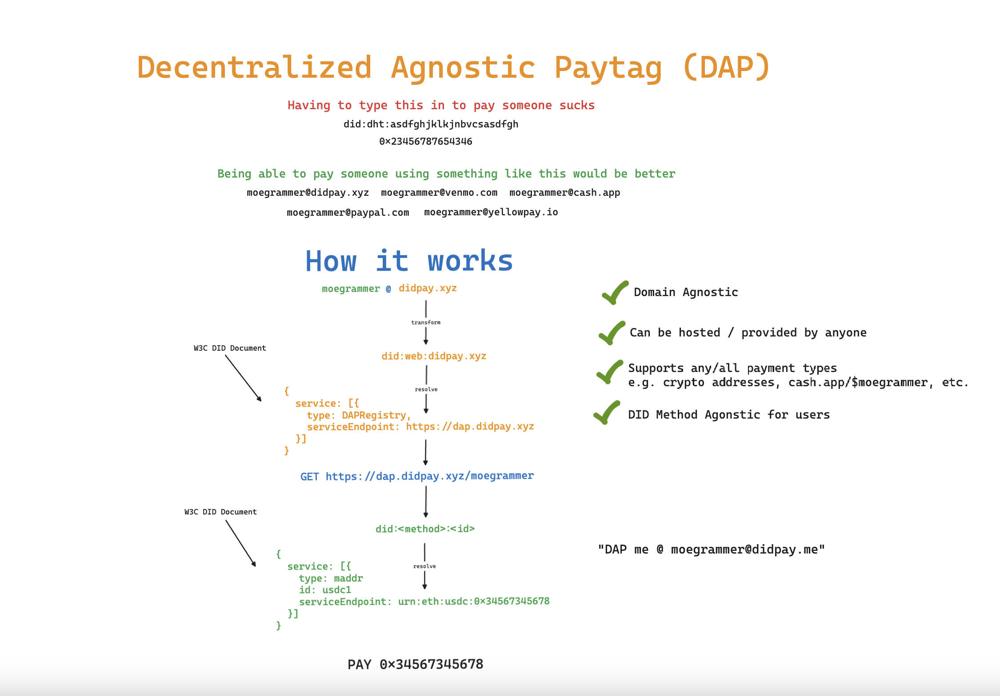

Decentralized Agnostic Paytags (DAPs) 1.0
========================================

**Specification Status**: Draft

**Latest Draft**: https://dap.did.me

**Draft Created**: April 12, 2024

**Last Updated**: May 20, 2024

**Editors**:
~ [Moe Jangda](https://github.com/mistermoe)

**Contributors**:
~ [Gabe Cohen](https://github.com/decentralgabe)

**Participate**:
~ [GitHub repo](https://github.com/TBD54566975/dap)
~ [File a bug](https://github.com/TBD54566975/dap/issues)
~ [Commit history](https://github.com/TBD54566975/dap/commits/main)

## Abstract

Decentralized Agnostic Paytags (DAPs) provide a standardized means to express human-friendly, resolvable payment handles that abstract over various currencies and payment networks. DAPs allow individuals to register memorable handles that resolve to a [[ref:Decentralized Identifier]] containing one or more associated payment addresses. This enables easy cross-app and cross-currency payments using a simple identifier. The syntax and data model used by DAPs is conformant to the [[spec:DID-CORE]] specification.



## Introduction

### Problem Statement

Numerous financial applications worldwide, such as CashApp, YellowPay, Bitso, Coinbase, Chipper Cash, Paypal, and Venmo, enable individuals to transfer funds using various payment methods and financial instruments. These applications frequently offer a peer-to-peer (P2P) functionality that allows users within the same app to send and receive money using memorable handles, paytags, or aliases. However, these paytags are only functional within the context of the app in which they were created and cannot be used to facilitate transactions with individuals using other apps or services. Transferring the same currency across different apps or payment networks is often a challenging and error-prone process that involves copying and pasting long, confusing, and nuanced information. Furthermore, the complexity of the process can vary depending on the type of currency being used. For instance:

* Sending Bitcoin (BTC) via the Lightning Network differs from sending BTC on the main blockchain.
* Sending USD Coin (USDC) on the Ethereum blockchain involves different details and nuances compared to sending USDC on the Stellar network.
* Transferring fiat money to a mobile money wallet requires a different process than sending it to a bank account.

As a result, we are left with numerous large payment networks that exist in isolation. While life within each network may be convenient, moving money into and out of these networks can be a daunting and uncertain task. Moreover, individuals are required to navigate and understand the intricacies of each currency they wish to use. This presents a significant challenge, as it hinders individuals from using their preferred currency in the manner they desire. Consequently, before any money can be sent, a lengthy discussion often occurs between two parties to determine which payment methods and networks they have access to and can use for the transaction. As a result, individuals may find themselves managing multiple wallets and engaging in tense negotiations about which one to use every time they need to send or receive money.

### Decentralized Agnostic Paytags

To address these challenges, we propose a solution that enables seamless and user-friendly money transfers across different apps and currencies. The objective of this specification is to introduce a standardized approach called [[ref:Decentralized Agnostic Paytags]] (DAPs). A DAP is a memorable handle, similar to an email address (e.g., `handle@domain`), that allows individuals to send and receive money regardless of the app or currency being used.

For example, consider a scenario where _Alice_ wants to pay back _Bob_ for a coffee:

```txt
Alice: Yo Bobby boy! Thanks for the coffee. What's your DAP so I can pay you back?

Bob: Anytime. DAP me up at waterboy@cash.app
```

With DAPs, _Alice_ can simply open her preferred payment app, enter _Bob's_ [[ref:DAP]] (`waterboy@cash.app`), and send the money. _Bob_ can then receive the money in his preferred app, regardless of whether it's the same as Alice's. This enables seamless transactions across various platforms, such as:

- CashApp ⟷ YellowPay
- Chipper Cash ⟷ Bitso
- Coinbase ⟷ CashApp
- CashApp ⟷ Self Custodial Wallet
- Paper Wallet ⟷ Paper Wallet

To achieve this, the specification aims to provide a standardized means to:

1. Express a _money address_ that represents a specific currency and payment method.
2. Associate multiple [[ref:money addresses]] with a resolvable identifier called a [[ref:Decentralized Identifier]] (DID).
3. Register the [[ref:DID]] with a human-friendly handle at one or more [[ref:DAP registries]]. For example, registering `did:dht:3456787654323rfvcxaw34tf` with CashApp under the handle `moegrammer` results in the DAP `moegrammer@cash.app`.
4. Resolve a [[ref:DAP]] to its corresponding [[ref:DID]], which can then be used to retrieve the associated [[ref:money addresses]].

### Requirements

To ensure the flexibility and decentralization of this system, the following requirements must be met:

1. Any currency should be expressible as a [[ref:money address]].
2. Any individual or institution must be able to run their own [[ref:DAP registry]].
3. Individuals must have the ability to custody and control their own resolvable identifier (a [[ref:DID]]).

By adhering to these requirements, the following specification aims to create an open and inclusive ecosystem that empowers individuals to use their preferred currencies and payment methods while enabling seamless interoperability across different apps and networks.

## Terminology

[[def:Decentralized Identifier, Decentralized Identifier, DID, DIDs, DID Document, DID Documents]]
~ A [W3C specification](https://www.w3.org/TR/did-core/) describing an identifier that enables verifiable, decentralized 
digital identity. A DID identifier is associated with a DID Document containing keys, services, and other data. 

[[def:Decentralized Agnostic Paytag, Decentralized Agnostic Paytags, DAP, DAPs]]
~ A human-friendly, email-like identifier that can be resolved to a [[ref:DID]] containing one or more payment addresses. 
A DAP has the format `<handle>@<domain>`.

[[def:DAP Registry, DAP Registries, Registry, Registries]]
~ A service that maintains a mapping between DAP handles and [[ref:DIDs]] for a given domain. Registries provide APIs
for resolving and optionally registering DAPs.

[[def:Handle, Handles]]
~ The local name portion of a DAP, unique to the [[ref:domain]] at which it is registered. 

[[def:Domain, Domains]]
~ Domains, or domain names are a key part of the Internet infrastructure. They provide a human-readable address for any web server available on the Internet as defined by [[spec:RFC1034]] [[spec:RFC1035]].

[[def:Money Address, Money Addresses]]  
~ A URN [[spec:RFC8141]] representing a means to send or receive a specific currency,
with the format `urn:<currency>:<curr_specific_part>`.
   
## Conformance
   
The key words "**MUST**", "**MUST NOT**", "**REQUIRED**", "**SHALL**", "**SHALL NOT**", "**SHOULD**", "**SHOULD NOT**",
"**RECOMMENDED**", "**MAY**", and "**OPTIONAL**" in this document are to be interpreted as described in 
[[spec:RFC2119]].

## DAP

A DAP is composed of a [[ref:handle]] and a [[ref:domain]], with the following structure:

```
<handle>@<domain>
```  
   
The [[ref:domain]] identifies the [[ref:DAP Registry]] where the handle is registered. The [[ref:handle]] itself is unique within that
domain. 

### Handle

A handle is unique to the [[ref:domain]] where it is registered. The [[ref:handle]] itself is **NOT** globally unique. The entire [[ref:DAP]] itself however, is globally unique. As such, restrictions to the format further than those imposed by this specification are left to the [[ref:domain]] where the [[ref:DAP]] is registered. 

The ****RECOMMENDED**** format for [[ref:DAPs]] is as follows:

- **UTF-8 Encoding**: Handle characters ****SHOULD**** be UTF-8 [[spec:RFC3629]], enabling support for internationalization.

- **Character Exclusions**: Handles ****MUST NOT**** include [control characters](https://en.wikipedia.org/wiki/Unicode_control_characters) or [punctuation](https://en.wikipedia.org/wiki/Template:Punctuation_marks_in_Unicode).

- **Length**: Handles ****MUST**** be between 3 and 30 characters.

:::note
Providing the flexibility for [[ref:domains]] to define their own formats is necessary in order to support pre-existing systems which  have defined their own formats.
:::

### Domain

The [[ref:domain]] portion of a [[ref:DAP]] is used to identify the [[ref:registry]] where the [[ref:DAP]] was registered. The [[ref:domain]] is used to resolve the [[ref:DAP]] to a [[ref:DID]].

### Resolution

DAP resolution refers to the process in which a [[ref:DAP]] is dereferenced to its corresponding [[ref:DID Document]], containing
information about [[ref:money addresses]].

The steps to resolve a DAP are as follows:

1. Split the DAP into [[ref:handle]] and [[ref:domain]] using the `@` delimiter. 

2. Construct a  `did:web` [[ref:DID Web]] using the domain.

3. [Resolve](https://www.w3.org/TR/did-core/#did-resolution) the DID to retrieve the DID Document.

4. Find the `dapregistry` service in the resolved [[ref:DID Document]].

5. Use the `serviceEndpoint` to construct the URL `<serviceEndpoint>/daps/<handle>`.

6. Perform a [GET request](https://developer.mozilla.org/en-US/docs/Web/HTTP/Methods/GET) to the registry URL [[spec:RFC1738]].

  * The response contains the [[ref:DID]] associated with the [[ref:DAP]].  

8. [Resolve](https://www.w3.org/TR/did-core/#did-resolution) the [[ref:DID]] to retrieve its [[ref:DID Document]].

9. Find all `maddr` service(s) in the [[ref:DID Document]] which contain [[ref:money addresses]].

### Money Address

A [[ref:money address]] is a payment-network-specific identifier embedded within a [[ref:DID Document]] that enables 
sending or receiving funds in a particular currency. It is represented by the following URN [[spec:RFC8141]] structure:

```
urn:<currency>:<curr_specific_part>  
```

The `<currency>` represents a code for the payment type (e.g. `usdc`, `btc`), while the `<curr_specific_part>`
contains currency-specific details like a blockchain address or payment URL. 

**Example Money Addresses**:

- **USDC on Ethereum**: `urn:usdc:eth:0x1234567890abcdef1234567890abcdef12345678`  
- **BTC LNURL**: `urn:btc:lnurl:https://someurl.com`
- **BTC Address**: `urn:btc:addr:1LMcKyPmwebfygoeZP8E9jAMS2BcgH3Yip`
- **KES Mobile Money**: `urn:kes:momo:mpesa:254712345678`

#### Currency Address Registry

| Network          | Format     | Example                                      |
|------------------|------------|----------------------------------------------|
| [USDC on Ethereum](https://www.circle.com/en/multi-chain-usdc/ethereum)| `urn:usdc:eth:<address>` | `urn:usdc:eth:0x1234567890abcdef1234567890abcdef12345678` | 
| [USDC on Stellar](https://www.circle.com/en/multi-chain-usdc/stellar)  | `urn:usdc:xml:<address>` | `urn:usdc:xlm:0xff35866aCb80ce4b169d1460cd48108955c1c445` |
| [BTC](https://bitcoin.org/) | `urn:btc:addr:<address>`| `urn:btc:addr:bc1qxy2kgdygjrsqtzq2n0yrf2493p83kkfjhx0wlh`|
| [LNURL](https://github.com/lnurl/luds) ([BECH-32](https://bips.xyz/173#bech32) encoded) | `urn:btc:lnurl:<url>`| `LNURL1DP68GURN8GHJ7UM9WFMXJCM99E3K7MF0V9CXJ0M385EKVCENXC6R2C35XVUKXEFCV5MKVV34X5EKZD3EV56NYD3HXQURZEPEXEJXXEPNXSCRVWFNV9NXZCN9XQ6XYEFHVGCXXCMYXYMNSERXFQ5FNS` |

:::todo
In order for [[ref:Money Addresses]] to be of any practical use, conventions will need to be established for each currency. A separate registry will be need to be maintained for currency definitions as conventions emerge.
:::

#### Representing Money Addresses in DID Documents

[[ref:Money addresses]] are included in [[ref:DID Documents]] as [service](https://www.w3.org/TR/did-core/#services) 
entries with type `maddr`. Each service contains these properties:

| Property         | Value      | Description                                                |
|------------------|------------|------------------------------------------------------------|
| `id`             | `string`   | Unique identifier for the address.                         | 
| `type`           | `maddr`    | Always `maddr`. Identifies the service as a money address. |
| `serviceEndpoint`| `[]string` | Array of 1 or more payment address URNs.                   |

:::note
Any number of money addresses can be associated with a DID. They can be represented as individual service entries in the DID Document.
:::

**Example Money Address Service**:

```json
{
  "type": "maddr",
  "id": "#btc-1",  
  "serviceEndpoint": ["urn:btc:addr:1LMcKyPmwebfygoeZP8E9jAMS2BcgH3Yip"]
}
```

**Example DID Document**:

_Other fields in the DID Document have been omitted for brevity._

```json
{
  "@context": "https://www.w3.org/ns/did/v1",
  "id": "did:dht:123456789abcdefghi",
  "service": [
    {
      "type": "maddr",
      "id": "#some-id",
      "serviceEndpoint": ["urn:usdc:eth:0x1234567890abcdef1234567890abcdef12345678"]
    }
  ]
}
```

## DAP Registry

A [[ref:DAP Registry]] maintains the mapping between [[ref:handles]] and [[ref:DIDs]] for a given [[ref:domain]]. It provides APIs for resolving
DAPs and optionally for registering new DAPs.  

To host a [[ref:DAP Registry]], a [[ref:domain]] ****MUST****: 

1. Host a resolvable `did:web` [[ref:DID Web]] DID Document at `https://<domain>/.well-known/did.json`.

2. Advertise the DAP Registry in a `dapregistry` service as follows:

```json
{
  "id": "did:web:example.com", 
  "service": [{
    "type": "dapregistry",
    "serviceEndpoint": ["https://dap.example.com"] 
  }]
}
```

:::note
The value of `serviceEndpoint` is the base URL of the [[ref:domain]]'s [[ref:DAP Registry]] HTTP API and can be any URL that the domain owner chooses.
:::

### Registry HTTP API

DAP Registries ****MUST**** provide an HTTP API with the following specifications.

#### CORS 

A registry ****MUST**** have a [CORS policy](https://developer.mozilla.org/en-US/docs/Web/HTTP/CORS) allowing 
requests from any origin, to enable access by any app that wishes to resolve or register DAPs.

#### Responses

Responses are JSON objects with the following fields:

| Field   | Type              | Required | Description                                |
|---------|-------------------|----------|--------------------------------------------|
| `data`  | `any`             | N        | Endpoint-specific response data on success |
| `error` | [`Error`](#error) | N        | Details if an error occurs                 |

The fields `data` and `error` are mutually exclusive.

##### Error 
  
An `Error` object has the following properties:  
  
| Field     | Type     | Required | Description                  |
|-----------|----------|----------|------------------------------|
| `message` | `string` | Y        | Human-readable error details |

Responses ****MUST**** include the [`Content-Type: application/json` header](https://developer.mozilla.org/en-US/docs/Web/HTTP/Headers/Content-Type).   

#### Resolution Endpoint

Returns the [[ref:DID]] currently associated with the given [[ref:handle]].  

* **Method**: `GET`

* **Path**: `<serviceEndpoint>/daps/<handle>`

  * `handle` - string - **REQUIRED** - the [[ref:handle]] to registry with the given registry.

**Response**:

  * `200` - Success.

    * `did` - string - **REQUIRED** - The resolved DID for the requested handle.

    * `proof` - string - Signed payload from the DID registration.

  * `404` - Not found. If the handle does not exist or has no associated DID.

#### Registration Endpoint

Registers a [[ref:DAP]], associating the given [[ref:handle]] with a [[ref:DID]] at the [[ref:domain]] hosting the registry.

> This endpoint is **OPTIONAL**. Registries may choose whether to allow individuals to register their
own DIDs or to use an external mechanism.  

* **Method**: `POST`

* **Path**: `<serviceEndpoint>/daps`

* **Request Body**:

  * `id` - string - **REQUIRED** - The typeid with prefix `reg`.

  * `domain` - string - **REQUIRED** - The [[refdomain]] where the handle is being registered.

  * `handle` - string - **REQUIRED** - The desired [[ref:handle]].

  * `did` - string - **REQUIRED** - The [[ref:DID]] being registered.

  * `signature` - string - **REQUIRED** - A compact JWS [[spec:RFC7515]] with detached content ([see below](#signature-scheme)).

* **Response**:
  
  * `202` - Accepted.

:::todo
Response should include a signature over the registration request digest. The signature MUST be computed using a private key associated to the registry's DID.

Include 303: See Other with a Location header that contains a URL for further authentication. This is to allow for scenarios where the registry is a pre-existing app that provides handles to individuals via their sign up process and wants to allow individuals to associate their own DIDs with their handles.
:::

#### Signatures

The `signature` needed by the [Registration Endpoint](#registration-endpoint) is a detached JWS as per [[spec:RFC7515]] over the SHA-256 [[spec:RFC6234]] digest of the canonicalized [[spec:RFC8785]] JSON request payload, with the JWS `kid` header set to the [assertion method](https://www.w3.org/TR/did-core/#assertion) Verification Method ID from the [[ref:DID]] being registered.

##### Signatures Scheme

To compute a registration request's signature, perform the following steps:

1. Construct the JWS Header as defined in [[spec:RFC7515]]. The header ****MUST**** include the following properties:

  * [`alg`](https://datatracker.ietf.org/doc/html/rfc7515#section-4.1.1).

  * [`kid`](https://datatracker.ietf.org/doc/html/rfc7515#section-4.1.4) - the fully qualified [Assertion Method ID](https://www.w3.org/TR/did-core/#verification-methods).

2. Compute the registration request's [digest](#digest-scheme) and use it as the JWS Payload.

3. Compute the JWS as defined in [[spec:RFC7515]] [section 5.1](https://datatracker.ietf.org/doc/html/rfc7515#section-5.1).

3. Detach the payload as defined in [[spec:RFC7515]] [appendix F](https://datatracker.ietf.org/doc/html/rfc7515#appendix-F).

4. Set the value of the `signature` property to the resulting compact detached JWS.

##### Digest Scheme

A [digest](https://en.wikipedia.org/wiki/Cryptographic_hash_function) is a representation of data in a condensed form. When used in cryptographic contexts, this condensed form provides a way to verify the integrity of data without having to compare the data in its entirety.

To compute a registration request's digest, perform the following steps:

1. Initialize payload to be a JSON object that contains all of the registration request's properties _except_ for the `signature property.

2. JSON serialize payload using the JSON Canonicalization Scheme (JCS) [[spec:RFC8785]].

3. Compute the SHA-256 [[spec:RFC6234]] hash over the serialized payload.

4. Encode the resulting hash using the base64url scheme without padding as defined in [[spec:RFC7515]] [appendix C](https://datatracker.ietf.org/doc/html/rfc7515#appendix-C).

#### Metadata Endpoint

Returns metadata about the Registry's capabilities.

* **Method**: `GET`

* **Path**: `<serviceEndpoint>/metadata`

* **Response**:

  * `200` - Success.

    * `registration` – `RegistrationMetadata` - **REQUIRED** - Registration-related metadata.

      * `enabled` - boolean - **REQUIRED** - Whether the registry allows registrations.

      * `supportedDidMethods` - []string - DID methods supported.

## Privacy Considerations

* [[ref:DAPs]] and the associated DIDs/payment addresses are public information visible to anyone who can access the
Registry. Avoid including personally identifiable or other sensitive data.

* To mitigate privacy risks, users may choose to create multiple [[ref:DAPs]], each associated with different payment
addresses and used in different contexts.

## Adoption Considerations

### Pre-existing Apps

Pre-existing apps that provide individuals with usernames, handles, or paytags can provision a DAP for each pre-existing handle by making it resolvable as a `did:web` (e.g. `did:web:<domain>:<handle>`).

**Example**:

CashApp is a pre-existing app that provides individuals with CashTags (e.g. `$moegrammer`) and decides to adopt DAPs by standing up a [[ref:DAP Registry]].

Per the [[ref:DAP Registry]] section of this specification, CashApp creates a `did:web` (specifically `did:web:cash.app`) by hosting a [[ref:DID Document]] at https://cash.app/.well-known/did.json and advertises their [[ref:Registry]] as a service in the [[ref:DID Document]].

CashApp makes each CashTag resolvable as a `did:web` (e.g. `did:web:cash.app:$moegrammer`) per the [did:web specification for resolution](https://w3c-ccg.github.io/did-method-web/#read-resolve) by responding to requests to https://cash.app/$moegrammer/did.json with a [[ref:DID Document]] specific to the CashTag. The resulting DID Document contains two money address service entries: one that includes a BTC address, and another that includes an LNURL.

As a result, every CashTag can now be used as a [[ref:DAP]]. `$moegrammer@cash.app` is resolved using CashApp's [[ref:DAP Registry]] to `did:web:cash.app:$moegrammer` which in turn resolves to the [[ref:DID Document]] that contains the aforementioned money addresses.

Any app that supports sending money to a [[ref:DAP ]]can now send BTC via L1 or Lightning directly to any CashTag without the sender having to ask the recipient for a lightning invoice or what their BTC address is. The only information the sender needs is the recipient's [[ref:DAP]] (e.g. `moegrammer@cash.app`). The sender's app will take care of the rest. As is the case with receiving BTC on CashApp today, the recipient will receive a push notification when their BTC arrives.

:::note
This is not too far fetched as CashApp already provides unique resolvable URLs per CashTag e.g. https://cash.app/$moegrammer that can be used to retrieve a CashApp specific QR code.
:::

Lasty, CashApp can allow individuals to BYODID (Bring Your Own DID) by enabling Registration at their DAP Registry. This would allow individuals to associate a [[ref:DID]] they control with their CashTag.

## Reference

[[def:DID Web, did:web]]
~ [did:web Method Specification](https://w3c-ccg.github.io/did-method-web/). C. Gribneau, M. Prorock, O. Steele,
O. Terbu, M. Xu, D. Zagidulin; 06 May 2023. [W3C](https://www.w3.org/).

[[spec]]